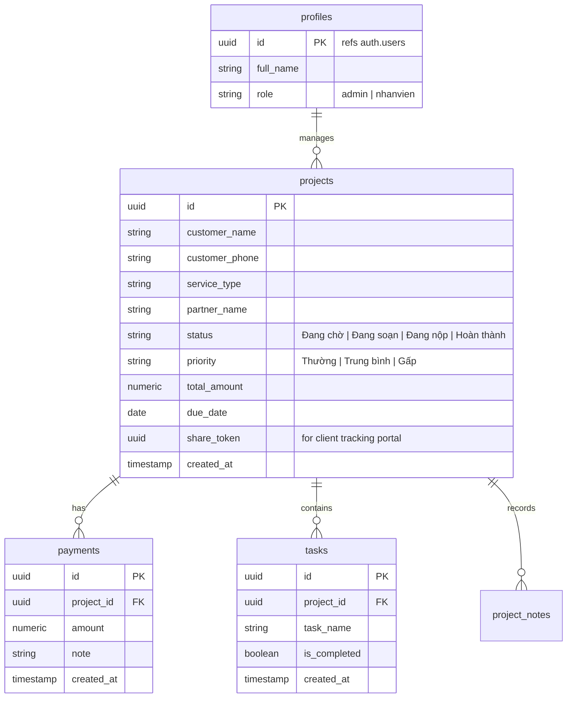

# 🎓 CẨM NANG PHÁT TRIỂN & TỐI ƯU HÓA GSLAW FLOW (PROJECT SKILL FILE)

Cẩm nang này đúc kết toàn bộ kiến thức kỹ thuật, cấu trúc mã nguồn, cơ sở dữ liệu và các quyết định thiết kế cốt lõi của dự án **GSLaw Flow**. File này được thiết kế đặc biệt để giúp các AI Agent hoặc Lập trình viên trong các phiên làm việc tiếp theo hiểu ngay lập tức và tối ưu hóa hệ thống mà không cần nghiên cứu lại từ đầu.

---

## 🛠️ 1. TECH STACK (CÔNG NGHỆ SỬ DỤNG)
- **Framework:** Next.js (App Router, strict React).
- **Styling:** Tailwind CSS v4 (Sử dụng `@import` trong `globals.css` với các class `dark:` hỗ trợ Dark Mode hoàn toàn).
- **Cơ sở dữ liệu & Auth:** Supabase (PostgreSQL) + RLS (Row Level Security).
- **Quản lý Theme:** `next-themes` (`ThemeProvider` bọc ngoài `layout.tsx`).
- **Thư viện Năng suất:**
  - `react-big-calendar` (Chế độ Lịch biểu).
  - `cmdk` (Thanh Tìm kiếm Toàn cầu `Ctrl + K`).
  - `googleapis` (Đồng bộ Google Sheets API v4).
  - `lucide-react` (Hệ thống Icon).

---

## 📊 2. DATABASE SCHEMA (CẤU TRÚC SUPABASE)

---

## 🌟 3. CÁC TÍNH NĂNG NÂNG CAO ĐÃ TRIỂN KHAI

### 🌗 3.1. Hệ thống Dark Mode Toàn cục
- **Cách hoạt động:** Toggle nằm ở Header góc trên bên phải. Trạng thái được lưu trong `localStorage`.
- **Lưu ý Code:** Khi viết giao diện mới, tuyệt đối không dùng `inline styles` tĩnh. Hãy sử dụng class Tailwind kèm hậu tố `dark:` để hỗ trợ Dark Mode.
  *Ví dụ:* `className="bg-white dark:bg-slate-900 border border-slate-200 dark:border-slate-700 text-slate-900 dark:text-slate-100"`

### 📅 3.2. Chế độ Lịch biểu (Calendar View)
- **Cách hoạt động:** Hiển thị hồ sơ lên lịch dựa trên cột `due_date` (Hạn chót).
- **Mã màu sự kiện tự động:**
  - `Đỏ` = Hồ sơ Gấp hoặc Quá hạn.
  - `Xanh lá` = Trạng thái "Hoàn thành".
  - `Vàng` = Trạng thái "Đang chờ".
  - `Xanh dương` = Các trạng thái khác.

### ⌨️ 3.3. Thanh Tìm kiếm Nhanh (Command Palette)
- **Cách hoạt động:** Bấm tổ hợp phím `Ctrl + K` (hoặc `Cmd + K`) để mở Popup tìm kiếm.
- **Tìm kiếm thông minh:** Tìm kiếm thời gian thực theo *Tên khách hàng* hoặc *Số điện thoại* và điều hướng siêu tốc sang trang chi tiết của dự án đó.
- **Lưu ý Kỹ thuật:** Đã thay thế `Command.Dialog` của `cmdk` bằng component `Command` trần bọc trong một overlay để tránh lỗi chặn Accessibility Title (`DialogTitle` error) trên Next.js Dev mode.

### 📄 3.4. Khởi tạo & Xuất Hợp đồng (Quick Export)
- **Cách hoạt động:** Bấm nút **"Tạo HĐ"** trên trang chi tiết để in mẫu hợp đồng.
- **Cơ chế ẩn:** Chèn HTML mẫu hợp đồng ẩn (`display: none`). Khi kích hoạt, CSS `@media print` sẽ ẩn toàn bộ giao diện phần mềm và chỉ hiển thị đúng mẫu hợp đồng chuẩn A4 để in hoặc xuất file PDF nhẹ, nét và giữ nguyên định dạng.

### 💬 3.5. Chia sẻ Zalo 1-Click (Zalo Deep-link)
- **Cách hoạt động:** Bấm nút "Zalo" tại trang chủ hoặc trang chi tiết.
- **URL Scheme:** `https://zalo.me/?text=[NỘI_DUNG_ENCODE]`
- **Nội dung tin nhắn tự động:** Chào khách hàng + Tên dự án + Trạng thái thực tế + Link Tracking cá nhân hóa bảo mật của khách hàng (`/tracking/[share_token]`).

### 🔌 3.6. Đồng bộ Google Sheets Real-time
- **Tập tin API:** `app/api/sync-sheets/route.ts`
- **Nguyên lý hoạt động:** 
  1. Khi có sự kiện Insert/Update hồ sơ trên Frontend (Add, Status change, Payment change), API sẽ được gọi ngầm.
  2. Sử dụng thư viện `googleapis` kết nối thông qua **Service Account JWT Client**.
  3. API tự động quét tìm ID trên file Sheet. Nếu có sẵn thì **Cập nhật** (`update`), nếu chưa có thì **Thêm mới** (`append`).
- **Khắc phục bản địa hóa:** Bỏ hẳn prefix `"Sheet1!"` trong dải ô dữ liệu (dùng `"A:J"` thay vì `"Sheet1!A:J"`). Điều này giúp API tự động nhận diện tab đầu tiên dù nó tên là "Trang tính1" (Tiếng Việt) hay "Sheet1" (Tiếng Anh).

---

## 💡 4. HƯỚNG DẪN TỐI ƯU CHO CÁC PHIÊN LÀM VIỆC SAU (TIPS FOR FUTURE AI AGENTS)

1. **Khi chỉnh sửa Styles:** 
   - Tuyệt đối không thêm `style={{ ... }}` tĩnh trừ phi bắt buộc. Hãy sử dụng class Tailwind v4 để bảo toàn khả năng Responsive và Dark Mode.
2. **Cấu hình môi trường (.env.local):**
   - Đảm bảo đầy đủ: `NEXT_PUBLIC_SUPABASE_URL`, `NEXT_PUBLIC_SUPABASE_ANON_KEY`, `GOOGLE_SERVICE_ACCOUNT_EMAIL`, `GOOGLE_PRIVATE_KEY` và `GOOGLE_SHEET_ID`.
   - Đối với `GOOGLE_PRIVATE_KEY`, giá trị phải được bọc trong dấu nháy kép `"..."` và giữ nguyên ký tự viết liền `\n` để API `replace(/\\n/g, '\n')` hoạt động chính xác.
3. **Khi tương tác với Supabase:**
   - Khi insert/update mà cần đồng bộ Google Sheets, hãy luôn nhớ gọi `.select().single()` để lấy về đầy đủ dữ liệu vừa ghi (bao gồm `id`, `created_at`, `share_token`), sau đó truyền trực tiếp sang hàm `syncToGoogleSheets(data)`.
